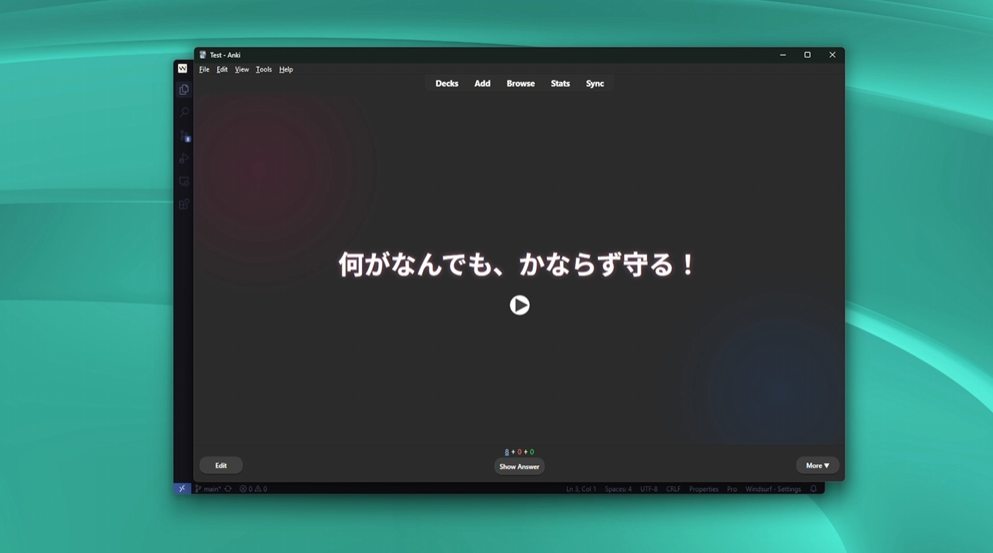

# anki-mcp

[](https://github.com/nietus/anki-mcp/actions/workflows/test.yml)
[](LICENSE)

Study and manage your [Anki](https://apps.ankiweb.net/) collection by talking to Claude (or any MCP client). 35 tools over [AnkiConnect](https://ankiweb.net/shared/info/2055492159): get quizzed in chat, see what is due and how your retention is going, find the cards you keep forgetting, create and clean up notes in bulk, and pause whole groups of cards until you want them back.

[](https://www.youtube.com/watch?v=NZomvkf8bio)

## What you can ask

- "What do I have to study today?" → due counts per deck, streak, reviews this week.
- "Quiz me on 10 due cards from my Spanish deck." → one question at a time, graded, and recorded in Anki with the next interval.
- "Which cards do I keep getting wrong? Help me fix them." → leeches, their review history, and rewrites you approve.
- "Suspend everything tagged HSK5 until my exam, and make it easy to bring back." → named pause that restores exactly those cards, scheduling intact.
- "Turn this article into cloze cards in my Biology deck." → duplicate-checked bulk add.
- "Add audio to every card in this deck that doesn't have it." → Azure TTS in bulk.
- "Move the cards tagged `grammar` to a new subdeck" / "rename the tag `todo` to `review`" / "spread my backlog over the next two weeks".

Bulk changes can be previewed with a dry run, deleting always needs a confirmation step, and when Anki is closed the assistant is told to ask you to open it instead of failing silently.

## Install

You need [Node.js](https://nodejs.org/) 18+, Anki running, and the **AnkiConnect** add-on (code `2055492159`).

### Claude Desktop

Download `anki-mcp.mcpb` from the [latest release](https://github.com/nietus/anki-mcp/releases/latest) and drag it into **Settings → Extensions**. That's it.

### Claude Code

```bash
claude mcp add anki --scope user -- npx -y github:nietus/anki-mcp
```

### Cursor and other MCP clients

Add this to the client's MCP configuration:

```json
{
  "mcpServers": {
    "anki": {
      "command": "npx",
      "args": ["-y", "github:nietus/anki-mcp"]
    }
  }
}
```

On Windows, if the client cannot start `npx` directly, use `"command": "cmd"` with `"args": ["/c", "npx", "-y", "github:nietus/anki-mcp"]`.

### From source

```bash
git clone https://github.com/nietus/anki-mcp
cd anki-mcp
npm install
npm run build
```

Then point your client at `node /path/to/anki-mcp/build/client.js`. To build the Claude Desktop bundle yourself, run `npm run pack:mcpb` (output in `dist/anki-mcp.mcpb`).

## Configuration

All environment variables are optional. Put them in a `.env` file in the project folder or pass them through your MCP client.

| Variable | Default | Purpose |
| --- | --- | --- |
| `AZURE_API_KEY` | – | Enables the audio tools (Azure Text-to-Speech). |
| `AZURE_REGION` | `eastus` | Azure Speech region. |
| `ANKI_CONNECT_HOST` | `http://127.0.0.1` | AnkiConnect host. |
| `ANKI_CONNECT_PORT` | `8765` | AnkiConnect port. |
| `ANKI_CONNECT_KEY` | – | AnkiConnect API key, if you set one in the add-on config. |

## Development

```bash
npm test           # unit + in-memory MCP server tests (no Anki needed)
npm run inspector  # try the tools interactively
```

## Available Tools

Every tool is annotated as read-only, write or destructive, so clients like Claude Desktop can auto-approve reads and ask before destructive changes. Errors (including "Anki is not running") come back as readable tool results.

Most bulk tools select cards or notes the same way: `deckName` (subdecks included), `tags` (matches any), `query` (any [Anki search](https://docs.ankiweb.net/searching.html), ANDed), or explicit `cardIds` / `noteIds`. Write tools accept `dryRun: true` to preview the change first.

### Studying

| Tool | What it does |
| --- | --- |
| `get_study_overview` | Today's new/learning/review counts per deck, cards reviewed today, streak, 7/30-day totals. |
| `get_due_cards` / `get_new_cards` | `num` cards to study (optionally from one `deckName`), with the interval each button would give. |
| `answer_cards` | Record answers (`cardId`, `ease` 1-4) and get each card's new interval. *(Previously `update_cards`.)* |
| `find_leeches` | Weakest cards (leech tag / many lapses), ranked by lapses and ease. |
| `get_card_history` | Full review log of up to 20 cards. |
| `get_retention_stats` | True retention (young/mature), reviews per day and time spent for a deck over N days. |
| `undo` | Undo the last action in Anki. |

### Selecting and scheduling cards

| Tool | What it does |
| --- | --- |
| `find_cards` | Paginated search (`query`, `limit`, `offset`); pick the sections to return with `include`: `question`, `answer`, `fields`, `stats`. |
| `suspend_cards` / `unsuspend_cards` | Deactivate/reactivate cards, e.g. all cards with tag X in deck Y. Scheduling is preserved. Pass a `label` when suspending (notes get the tag `paused::<label>`) and `unsuspend_cards { label }` later resumes exactly that group, leaving cards suspended for other reasons alone. |
| `move_cards` | Move cards to `targetDeck` (created if missing). |
| `reschedule_cards` | `set_due_date` (`days`: `0`, `1!`, `3-7`), `forget` (reset to new) or `relearn`. |

### Creating and editing notes

| Tool | What it does |
| --- | --- |
| `add_card` | Create one note. |
| `add_bulk` | Create many notes; duplicates/invalid notes are skipped and reported with the reason. |
| `add_cloze_cards` | Create cloze notes from text plus `terms` to hide, or text with `{{c1::...}}` markup. |
| `update_note_fields` / `bulk_update_notes` | Edit fields of existing notes. |
| `find_and_replace` | Plain or regex replace across notes, optionally limited to some `fields`. |
| `manage_tags` | `list` (with a filter: tag counts), `add`, `remove`, `rename`, `clear_unused`. |
| `add_image` | Add an image to a field from a `url`, local `path` or base64 `data`. |
| `delete_notes` | Two-step delete: the first call previews and returns a `confirmToken`, the second call (with the token) deletes. |

### Audio (requires `AZURE_API_KEY`)

| Tool | What it does |
| --- | --- |
| `add_card_with_audio` | Create a note with audio generated from `sourceField` into `audioField`. |
| `update_card_with_audio` | Generate audio for one existing note. |
| `bulk_generate_audio` | Generate audio for many notes (by default only those with an empty audio field), `limit` per call. |

Supported languages: en, es, fr, de, it, ja, ko, pt, pt-PT, ru, zh, ar, nl, hi, tr, pl, sv, fi, da, no, cs, hu, el, he, th, vi, id, ms, ro.

### Decks and note types

| Tool | What it does |
| --- | --- |
| `get_deck_names` / `create_deck` | List or create decks. |
| `get_deck_model_info` | Which note types a deck uses (call before adding cards to it). |
| `get_model_names` / `get_model_details` | List note types / fields, templates and CSS of one. |
| `edit_note_type_field` | `add`, `remove`, `rename` or `reposition` a field. |
| `update_note_type_templates` / `update_note_type_styling` | Replace templates or CSS. |
| `create_model` | Create a note type. |
| `sync` | Sync with AnkiWeb. |

## Prompts

| Prompt | What it does |
| --- | --- |
| `quiz_me` | Study session: one question at a time, graded and recorded in Anki. |
| `make_cards` | Turn a text into atomic flashcards (previewed before adding). |
| `leech_review` | Find the cards you keep forgetting and fix them. |

## Resources

- `anki://collection/overview` – study overview.
- `anki://search/isdue`, `anki://search/isnew`, `anki://search/deckcurrent` – up to 50 cards each.
- `anki://deck/{deckName}/overview` – due counts for one deck.
- `anki://model/{modelName}` – fields, templates and CSS of a note type.

## License

[MIT](LICENSE)
